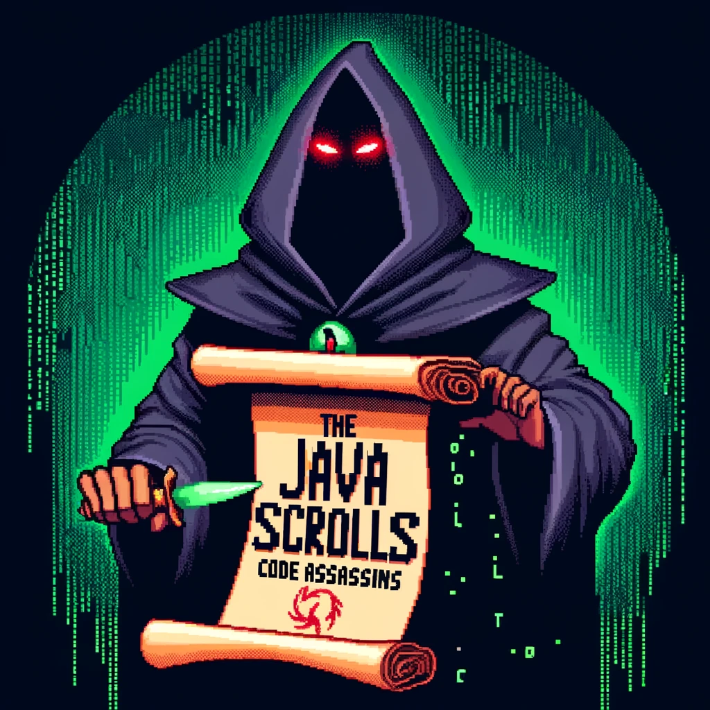
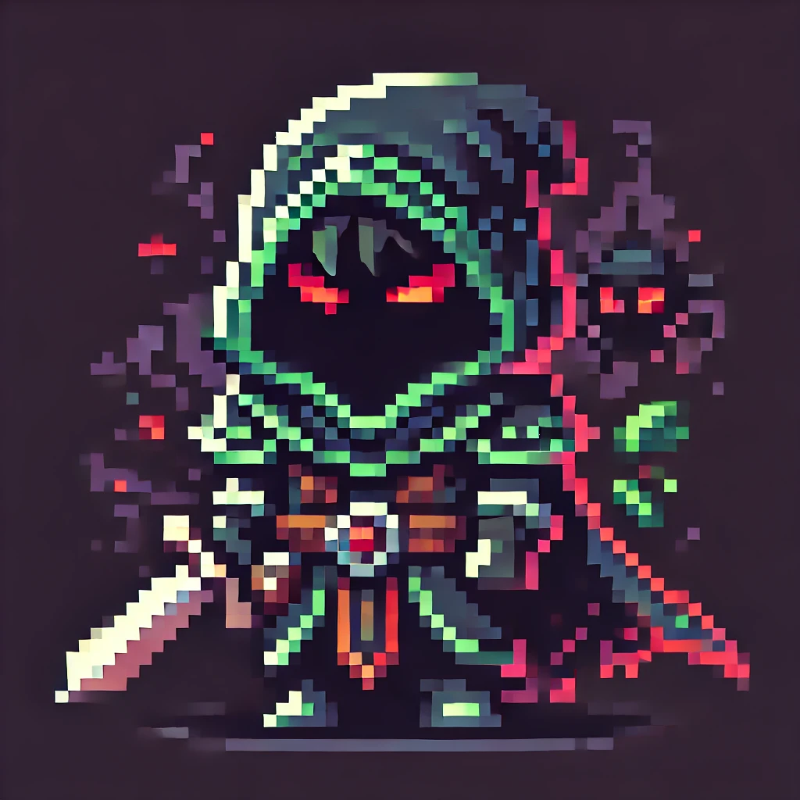
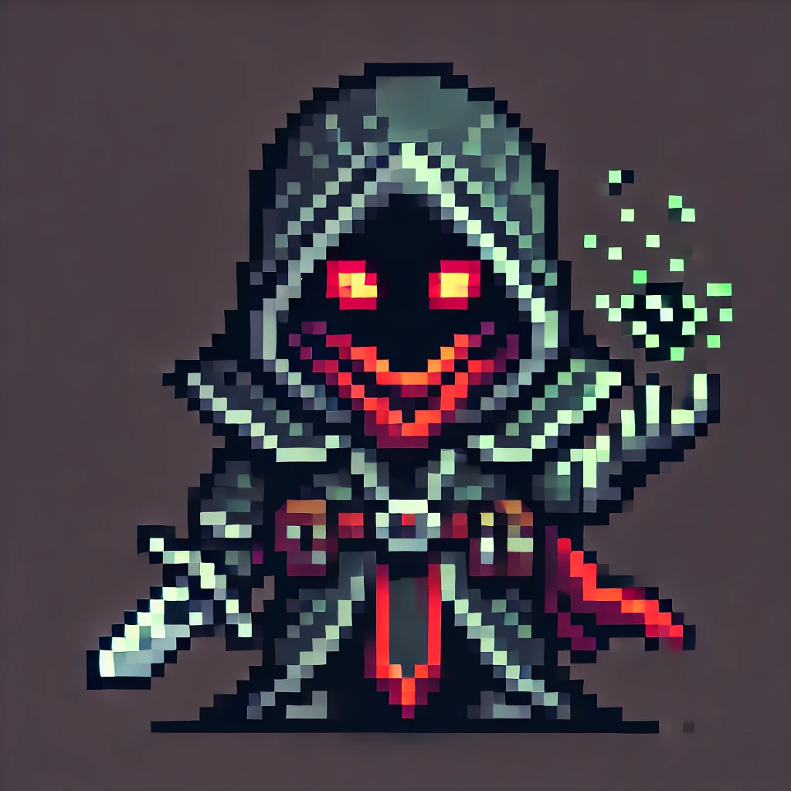
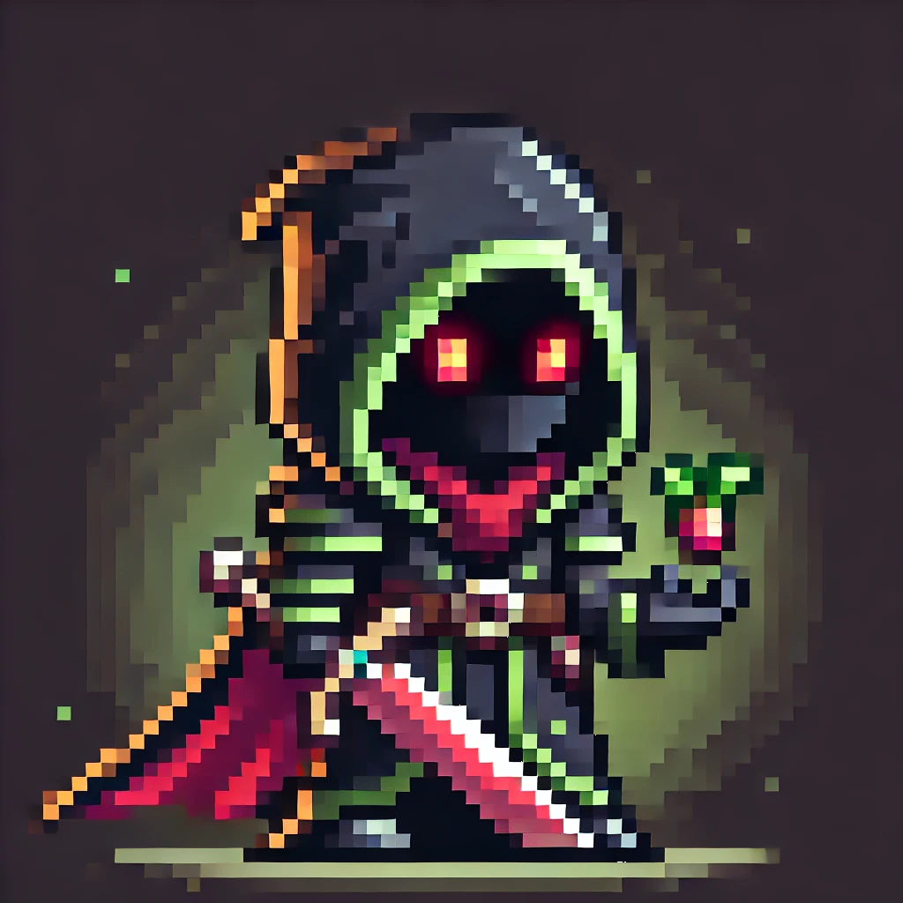
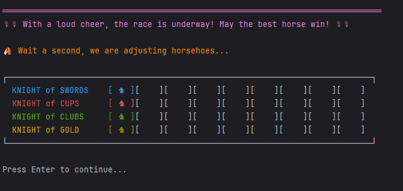

# 🏇 Carrera de caballos 🏇

¡Hola! 👋
Bienvenido a nuestro humilde proyecto. Una pequeña aplicación que te permite pasar un ratillo disfrutando de una carrera de caballos, como lo oyes, ¡y encima puedes hacer apuestas! Pero tranquilo.. no tienes que meter dinero, ni siquiera son monedas virtuales, son ¡CHIPS! 🍪

Lo que nació siendo un trabajo de clase, se ha convertido en todo un desafió grupal del que estamos super orgullosos, esperamos que disfrutéis de este pequeño trabajo.

 

## Integrantes del equipo
## The Java Scrolls: Code Assassins 🗡️📜 
 

  

 

<table>
  <tr>
    <td align="center">
        </td>
      <td align="center">
        </td>
      <td align="center">
        </td>
  </tr>
  <tr>
    <td>
      
    </td>
    <td>
      
    </td>
    <td>
      
    </td>
  </tr>
</table>

---

## Descripción Funcional del Juego 🎮
***Objetivo del Juego:***   
En este juego de carreras de caballo, los jugadores apuestan por los caballos que creen que ganará la carrera.  
La carrera esta representado por las cartas de la baraja española, donde los caballos se van moviendo por el tablero según
las cartas que se lanzan en cada turno.

***Instrucciones Básicas:***

🚀 Cómo comenzar una partida 
  

  • Inicio del juego: Ingresa la cantidad de jugadores totales, se ingresa el nombre de los jugadores humanos. 
  • Apuestas: Se selecciona el caballo a apostar y el número de la apuesta en fichas. 
  • Inicio de la carrera: Comienza el primer turno sacando la primera carta del mazo. 
  

  
📝 Reglas principales del juego. 

  • Selección de jugadores humanos, mínimo un jugador humano y mínimo dos jugadores en total.
    El máximo de jugadores permitidos sumando humanos y bots es de 6.
  • Carrera por turnos: Cada ronda representa un turno en la carrera, donde se determina el caballo que se movera según
  el palo de la última carta tirada. 
  • Movimiento de los caballos: El caballo que se corresponde con el palo de la última carta tirada avanza una casilla en el tablero. 
  Si el turno es múltiplo de 5 se retrocede una casilla. 
  • Ganador de la carrera: El primer caballo en llegar a la última casilla, se reparten las apuesta entre los jugadores que han ganado. 
  
🎮 Explicación de los controles o comandos importantes. 
  

    • Iniciar partida: Se indica el número de jugadores y sus nombres por consola. 
    • Seleccionar caballo y apuesta: Cada jugador selecciona un caballo y una apuesta en fichas. 
    • Continuar carrera: Despúes de cada turno se ejecuta una pausa, presionar Enter para continuar. 
  

  
***Características Principales:***

  • Multijugador: Permite entre 2 y 6 jugadores. 
  • Apuestas por carrera: Los jugadores eligen sus apuestas antes de iniciar la carrera. 
  • Clasificación de jugadores: Los jugadores se clasifican según el bankroll acumulado tras cada carrera. 
  • Narración de la carrera: La consola muestra mensajes narrativos, detallando movimientos y posiciones de los caballos en el tablero. 
  • Dinámica de eliminación: Los jugadores que pierden todas sus fichas quedan eliminados del juego. 

 

  

---

## Descripción Técnica ⚙️
***Arquitectura General del Proyecto***

El proyecto sigue una arquitectura en capas, separando la lógica en diferentes módulos para mejorar la organización, la mantenibilidad y la claridad del código.
A continuación, se describe la función y las interacciones de cada módulo:
 
1.Módulo controller 
  • Contiene el controlador principal (GameController.java), que orquesta el flujo del juego y coordina las interacciones entre los diferentes componentes. 
  • GameController actúa como intermediario, gestionando el flujo de información y las llamadas entre la vista y la lógica del juego en el modelo. 
  • Cada turno, el controlador toma decisiones y coordina la ejecución de las reglas del juego. 
2.Módulo model: 
  • model/Board: Gestiona el tablero de juego y el estado de los caballos en la carrera. 
  • model/GameHorsesRace: Representa la lógica principal de la carrera de caballos, gestionando el estado general del juego, los turnos y la mecánica de movimiento. 
  • model/deck: Este submódulo encapsula las clases relacionadas con las cartas: 
    • Card, CardFace, CardSuit, y FacedCard definen los aspectos de las cartas del juego, como su valor, tipo y la relación con los caballos. 
  • model/player: Gestiona la lógica relacionada con los jugadores y las apuestas, incluyendo clases para jugadores humanos (Human.java) y bots (Bot.java). Cada jugador puede realizar         apuestas en la carrera. 
  3.Módulo utils: 
    • Contiene utilidades de apoyo al proyecto, como ConsoleInOut para gestionar la entrada y salida por consola, Colors para el manejo de colores ANSI, y Pause para controlar las pausas        entre acciones. 
  4.Módulo view: 
    • ConsoleView: Proporciona una interfaz de usuario en consola para la visualización de la carrera, la información de los turnos y la dirección de movimiento de los caballos. 
    • La vista interactúa principalmente con el GameController y permite visualizar el estado del juego, las apuestas y los resultados. 

### Diagramas de Clases

- **Descripción:** Explica brevemente cómo se relacionan las clases principales, destacando sus roles en el juego y cualquier patrón de diseño relevante.

### Estructura de Directorios

<table align="center" border="6px">
  <tr>
    <td>
      <pre>
📦 Práctica UF4
 ┣ 📂 src
 ┃ ┣ 📜 Main.java
 ┃ ┣ 📂 controller
 ┃ ┃ ┣ 📜 GameController.java
 ┃ ┣ 📂 model
 ┃ ┃ ┣ 📜 Board.java
 ┃ ┃ ┣ 📜 GameHorsesRace.java
 ┃ ┃ ┣ 📜 PlayerManager.java
 ┃ ┃ ┣ 📂 deck
 ┃ ┃ ┃ ┣ 📜 Card.java
 ┃ ┃ ┃ ┣ 📜 CardFace.java
 ┃ ┃ ┃ ┣ 📜 CardsDeck.java
 ┃ ┃ ┃ ┣ 📜 CardSuit.java
 ┃ ┃ ┃ ┣ 📜 FacedCard.java
 ┃ ┃ ┃ ┗ 📜 NumeredCard.java
      </pre>
    </td>
    <td>
      <pre>
 ┃ ┃ ┣ 📂 player
 ┃ ┃ ┃ ┣ 📜 Bet.java
 ┃ ┃ ┃ ┣ 📜 Bot.java
 ┃ ┃ ┃ ┣ 📜 Human.java
 ┃ ┃ ┃ ┗ 📜 Player.java
 ┃ ┣ 📂 utils
 ┃ ┃ ┣ 📜 Colors.java
 ┃ ┃ ┣ 📜 ConsoleInOut.java
 ┃ ┃ ┗ 📜 Pause.java
 ┃ ┗ 📂 view
 ┃ ┃ ┗ 📜 ConsoleView.java
      </pre>
    </td>
  </tr>
</table>

### Tecnologías y Herramientas
• **Lenguaje de programación:** PHP
- **Entorno de desarrollo:** Visual Studio Code, XAMPP, etc.

---

## Instalación y Ejecución 🚀
1. Clona el repositorio: `git clone https://github.com/tu_usuario/tu_proyecto.git`
2. Abre el proyecto en tu entorno de desarrollo.
3. Configura las dependencias (si aplica).
4. Inicia el servidor y ejecuta el juego siguiendo las instrucciones.

---

## Créditos y Reconocimientos
Agradecimientos especiales a los profesores o compañeros que han contribuido o inspirado el proyecto.

