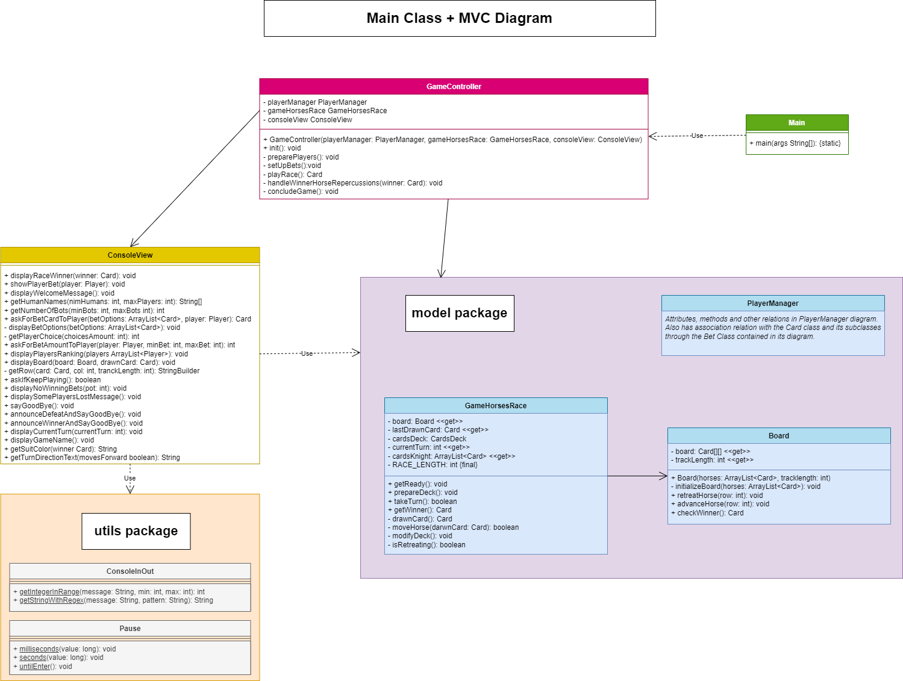
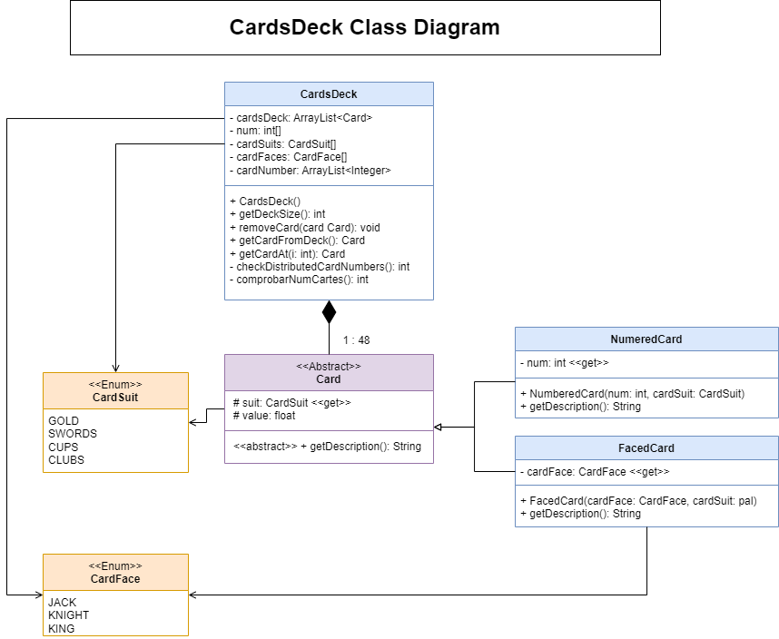
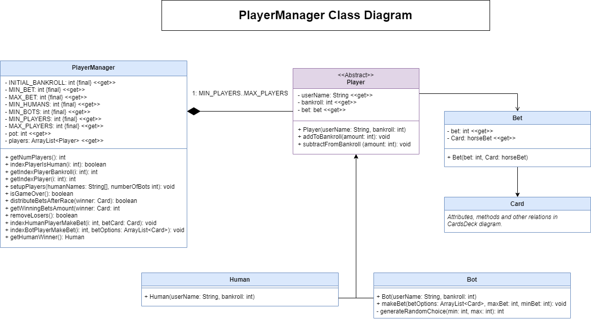

# 🏇 Carrera de caballos 🏇

¡Hola! 👋
Bienvenido a nuestro humilde proyecto. Una pequeña aplicación que te permite pasar un ratillo disfrutando de una carrera de caballos, como lo oyes, ¡y encima puedes hacer apuestas! Pero tranquilo.. no tienes que meter dinero, ni siquiera son monedas virtuales, son ¡CHIPS! 🍪

Lo que nació siendo un trabajo de clase, se ha convertido en todo un desafió grupal del que estamos super orgullosos, esperamos que disfrutéis de este pequeño trabajo.

 

### The Java Scrolls: Code Assassins 🗡️📜 
 

  

 

<table>
  <tr>
    <td align="center">
        </td>
      <td align="center">
        </td>
      <td align="center">
        </td>
  </tr>
  <tr>
    <td>
      
    </td>
    <td>
       
    </td>
    <td>
      
    </td>
  </tr>
</table>

 

---

 

### **Descripción funcional del juego** 

 

### ***🏅 Objetivo:***   
En este juego de carreras de caballo, los jugadores apuestan por los caballos que creen que ganará la carrera.  
La carrera esta representado por las cartas de la baraja española, donde los caballos se van moviendo por el tablero según las cartas que se lanzan en cada turno.

 

### **🚀 Instrucciones Básicas:**

    
• ***[Inicio del juego]*** Ingresa la cantidad de jugadores totales, se ingresa el nombre de los jugadores humanos.  
• ***[Apuestas]*** Se selecciona el caballo a apostar y el número de la apuesta en fichas.  
• ***[Inicio de la carrera]*** Comienza el primer turno sacando la primera carta del mazo.  
• ***[Trascurso]*** Se sacan cartas hasta encontrar un caballo ganador.  
• ***[Final de la carrera]*** Se redistribuyen las ganancias y finaliza la partida.  
• ***[Jugar de nuevo (Opcional)]*** Se inicia una nueva carrera.  

  
### **📝 Reglas del juego:** 

  
• ***Selección de jugadores humanos:*** mínimo un jugador humano y mínimo dos jugadores en total. El máximo de jugadores permitidos sumando humanos y bots es de 6.  
• ***Carrera por turnos:*** Cada ronda representa un turno en la carrera, donde se determina el caballo que se movera según el palo de la última carta tirada.  
• ***Movimiento de los caballos:*** El caballo que se corresponde con el palo de la última carta tirada avanza una casilla en el tablero. Si el turno es múltiplo de 5 se retrocede una casilla.  
• ***Ganador de la carrera:*** El primer caballo en llegar a la última casilla, se reparten las apuesta entre los jugadores que han ganado.  
  
### **✨ Características Principales:** 

  
• ***Multijugador:*** Permite entre 2 y 6 jugadores.  
• ***Apuestas por carrera:*** Los jugadores eligen sus apuestas antes de iniciar la carrera.  
• ***Clasificación de jugadores:*** Los jugadores se clasifican según el bankroll acumulado tras cada carrera.  
• ***Narración de la carrera:*** La consola muestra mensajes narrativos, detallando movimientos y posiciones de los caballos en el tablero.  
 • ***Dinámica de eliminación:*** Los jugadores que pierden todas sus fichas quedan eliminados del juego.  

 

#### 🏁 Muestra de carrera 🏁

  

 

---

 

### **📊 Diagramas de Clases**

 

#### Main + MVC

 

#### CardsDeck

 

#### PlayerManager

 

---

 

### **⚙️ Descripción Técnica:**

  
El proyecto está organizado en capas, donde cada módulo tiene una función clara para mantener el código ordenado y fácil de manejar. A continuación se detalla el papel de cada módulo y cómo interactúan entre sí:

 

  
**🕹 Módulo controller**  
Este módulo alberga el controlador principal (*GameController.java*), que se encarga de gestionar el flujo del juego y de coordinar la comunicación entre los componentes principales. GameController actúa como el puente entre la interfaz de usuario y la lógica del juego, manejando la información y las decisiones durante cada turno para aplicar las reglas de la partida.

 

  
**🗃 Módulo model**  
• ***[Board]*** Lleva el control del tablero y de la posición de los caballos en la carrera.  
• ***[GameHorsesRace]*** Contiene la lógica central del juego de carreras, gestionando el estado general, el avance por turnos y las reglas de movimiento.  
• ***[model/deck]*** Este submódulo contiene las clases de las cartas:  
• ***[Card, CardFace, CardSuit, y FacedCard]*** Definen los aspectos de las cartas del juego, como su valor, tipo y la relación con los caballos.  
• ***[model/player]***  Incluye las clases relacionadas con los jugadores y sus apuestas, ya sean humanos (*Human.java*) o bots (*Bot.java*), que interactúan durante la carrera.

 

  
**🧰 Módulo utils:**  
Este módulo agrupa utilidades que apoyan el funcionamiento general, como *ConsoleInOut* para gestionar la interacción en consola, *Colors* para aplicar colores, y Pause para controlar pausas y ritmos del juego.

 
    

  
**👀 Módulo view:**  
ConsoleView proporciona una interfaz de usuario en consola para la visualización de la carrera, la información de los turnos y la dirección de movimiento de los caballos.  
La vista interactúa principalmente con el GameController y permite visualizar el estado del juego, las apuestas y los resultados. 

 

### 📁 Estructura de Directorios 📁

<table align="center" border="6px">
  <tr>
    <td>
      <pre>
📦 Práctica UF4
 ┣ 📂 src
   ┣ 📜 Main.java
   ┣ 📂 controller
   ┃ ┣ 📜 GameController.java
   ┣ 📂 model
   ┃ ┣ 📜 Board.java
   ┃ ┣ 📜 GameHorsesRace.java
   ┃ ┣ 📜 PlayerManager.java
   ┃ ┣ 📂 deck
   ┃ ┃ ┣ 📜 Card.java
   ┃ ┃ ┣ 📜 CardFace.java
   ┃ ┃ ┣ 📜 CardsDeck.java
   ┃ ┃ ┣ 📜 CardSuit.java
   ┃ ┃ ┣ 📜 FacedCard.java
   ┃ ┃ ┗ 📜 NumeredCard.java
   ┃ ┣ 📂 player
   ┃ ┃ ┣ 📜 Bet.java
   ┃ ┃ ┣ 📜 Bot.java
   ┃ ┃ ┣ 📜 Human.java
   ┃ ┃ ┗ 📜 Player.java
   ┣ 📂 utils
   ┃ ┣ 📜 Colors.java
   ┃ ┣ 📜 ConsoleInOut.java
   ┃ ┗ 📜 Pause.java
   ┗ 📂 view
     ┗ 📜 ConsoleView.java
      </pre>
    </td>
  </tr>
</table>

 

### 🛠️ Tecnologías y Herramientas 🛠️

 

  
   

  Integrantes:
  Roger Navarro, 
  Samuel Mateos, 
  Leandro Struni 

